# Nodejs + VisualStudioCode + Express + MySql 프로젝트


## 1. Visual Studio Code 에서 NodeJS 진행하기 


1-1) nodejsworkspace 워크스페이스 폴더 생성하고 Visul Studio Code 열기


1-2) 보기 메뉴 -> 통합 터미널

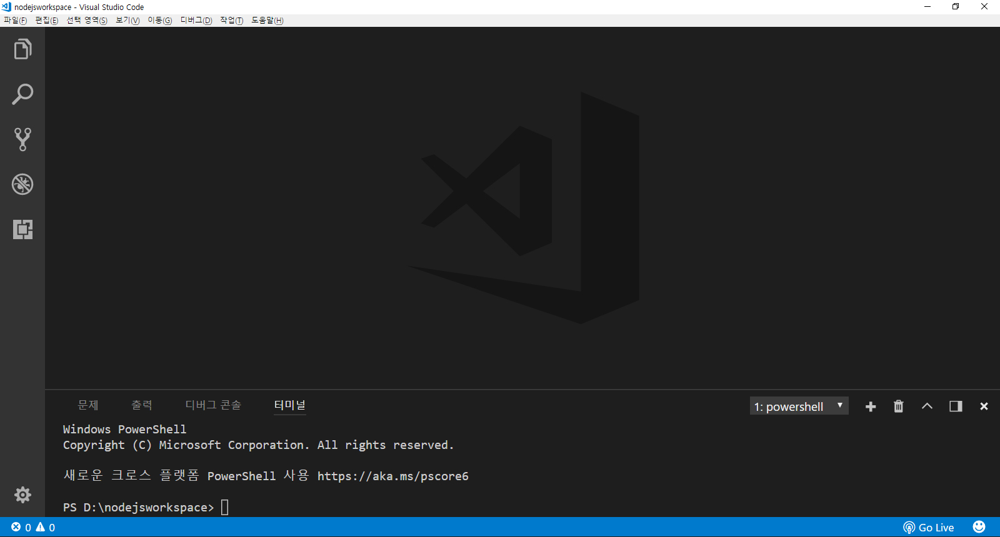

1-3) 터미널에서 노드 확인하기
```command
    node -v
```

1-4) start.js로 다음 내용을 작성 후 저장
```javascript
console.log("Hello Node Javascript")
```

1-5) 터미널에서 실행하기
```command
    D:\nodejsworkspace>node start.js
```

1-6) start.js에 전역변수 설정 후 다시 터미널에서 실행하기
```javascript
//전역변수 설정
__filename = "data1.dat"
__dirname = "data"

console.log("파일경로 : "+__dirname+"/"+__filename)
```
```command
    D:\nodejsworkspace>node start.js
```

1-7) module.js 파일이름으로 모듈 작성하기
```javascript
exports.abs = function(number) {
  if(0 < number){
    return number;
  }else{
    return -number;
  }
}
exports.circleArea = function(radius){
  return radius * radius * Math.PI
}
```

1-8) main.js 파일에서 기작성된 module.js를 가져와 실행하기
```javascript
var module = require('./module.js');
console.log('abs(-273) = %d', module.abs(-273));
console.log('circleArea(3) = %d', module.circleArea(3));
```
```command
    D:\nodejsworkspace>node main.js
```

결과 : 

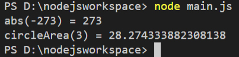


------------------------------------------------------


## 2. NodeJS에서 제공하는 기본 모듈

### 2-1. url 모듈

실습1) 아래와 같이 url 모듈을 활용하는 예제를 작성하여 urlmodule.js 로 저장한 후 실행하기
```javascript
const { parse } = require('path');
var url = require('url');

var parseObject = url.parse('http://www.hanbit.co.kr/store/books/look.php?p_code= B4250257160');
console.log(parseObject);
```  
```command
    D:\nodejsworkspace>node urlmodule.js
```

결과 :

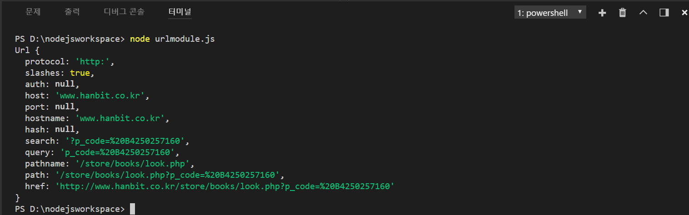

<br><br>

### 2-2. querystring 모듈

실습1) 아래와 같이 querystring.js 로 저장한 후 실행하기
```javascript
const { parse } = require('path');

//URL
var url = require('url');

var parseObject = url.parse('http://www.hanbit.co.kr/store/books/look.php?p_code= B4250257160');
// console.log(parseObject);

//쿼리스트링
var querystring = require('querystring');
console.log(querystring.parse(parseObject.query));
```  
```command
    D:\nodejsworkspace>node querystring.js
```

결과 :

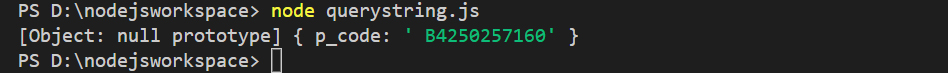

<br><br>

### 2-3. crypto 모듈

실습1) 아래와 같이 cripto.js 로 저장한 후 실행하기

```javascript
var crypto = require('crypto');

var key = '비밀키';
var input = 'kim';

var cipher = crypto.createCipher('aes192', key);
cipher.update(input, 'utf-8', 'base64');
var cipheredOutput = cipher.final('base64');

console.log('원래 문자열 : ' + input);
console.log('암호화 : ' + cipheredOutput);

var decipher = crypto.createDecipher('aes192', key);
decipher.update(cipheredOutput, 'base64', 'utf-8');
var decipheredOutput = decipher.final('utf-8');

console.log('복호화 : ' + decipheredOutput);
```

결과 :

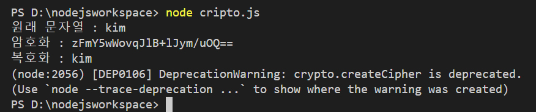

<br><br>

### 2-4. fs 모듈 (file system)

#### 2-4-1. 비동기 방식 메서드
```
fs.readFile(filename, [options], callback)
fs.writeFile(filename, data, [options], callback)
```

#### 2-4-2. 동기 방식 메서드
```
fs.readFileSync(filename, [options])
fs.writeFileSync(filename, data, [options])
```

#### 2-4-3. read
readFileSync는 동기 처리
readFile은 비동기 처리

실습1) 아래와 같이 fsread.js 로 저장한 후 실행하기

```javascript
var fs = require('fs');

var text = fs.readFileSync('textfile.txt', 'utf-8');
console.log(text);

fs.readFile('textfile.txt', 'utf-8', (error, data) => {
  console.log(data);
})
```

결과 : 

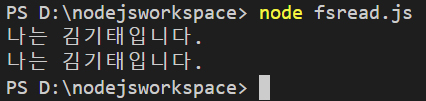


#### 2-4-4. write
writeFileSync는 동기 처리
writeFile은 비동기 처리

실습2) 아래와 같이 fswrite.js 로 저장한 후 실행하기

```javascript
var fs = require('fs');
var data = "안녕하세요 김기태대왕..!";

fs.writeFile('TextFileWrite.txt', data, 'utf-8', function(error){
  console.log('write');
});

fs.writeFileSync('TextFileWriteSync.txt', data, 'utf-8');
console.log('write_sync');
```

※ 예외처리
동기(Sync) 메서드는 결과값을 반환하고, 예외를 일으킬 수 있다. 비동기(Async) 메서드는 마지막 인자로 콜백함수를 받고, 아무 값도 반환하지 않는다.
동기 방식은 에러 메시지를 따로 받지 않으므로 try~catch 구문을 사용해 처리해야 한다.
비동기 방식은 인자로 받는 callback 함수의 매개변수인 error에 예외가 전달되므로 try~catch 구문을 사용할 필요가 없다.

<br><br>

결과 : 

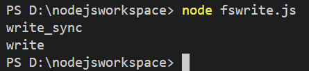

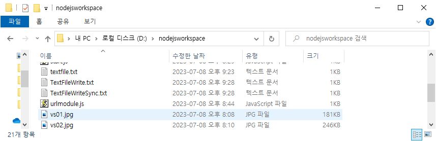

위와 같이 현재 디렉토리에 TextFileWrite.txt와 TextFileWriteSync.txt의 2개 파일이 만들어진다.

<br><br>

### 2-5. event 모듈

실습1) 아래와 같이 event1.js 로 저장한 후 실행하기

```javascript
const EventEmitter = require('events');
var custom = new EventEmitter();

custom.on('tick', function(code){
  console.log('이벤트가 실행되었습니다.')
})

//emit: 강제로 해당 이벤트를 발생시킨다.
custom.emit('tick');
```

결과 : 

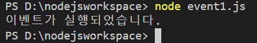


#### 2.5-1. 파일 분리해서 사용하기

실습2) 아래와 같이 rint.js와 app.js를 작성하여 실행하기 

rint.js (이벤트 생성)
```javascript
const EventEmitter = require('events');
var custom = new EventEmitter();
setInterval(()=>{
  exports.timer.emit('tick');
}, 1000);
```

app.js (실행)
```javascript
const rint = require('rint');
rint.timer.on('tick', function(code){
  console.log('이벤트를 실행했습니다.');
})
```

node app.js를 입력하면 '이벤트를 실행했습니다'가 1초에 한 번씩 콘솔에 찍히게 된다.

<br><br><br>

## 3. 웹(http) 모듈 - ch01

### 3-1. 서버의 시작과 종료

실습1) 아래 내용을 ch01/httpmodule1.js 에 작성하고, 실행하기

```javascript
//http 모듈 추출 (import)
const http = require('http');

//웹 서버 생성
const server = http.createServer();

//포트 설정 - 넉넉하게 큰 번호를 써 주면 충돌할 일이 없다. 
//서버가 실행되면 콘솔에 출력되도록 한다.
server.listen(52273, ()=>{ 
  console.log('Server Running at http://127.0.0.1:52273');
}); 

//20초 후 서버 종료
setTimeout(function(){
    console.log('서버 종료');
    server.close();
  }, 20000);
```

결과 : 

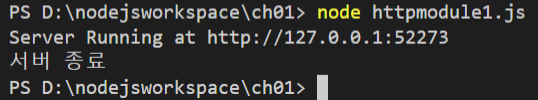

<br>

실습2) 아래 내용을 ch01/httpmodule2.js 에 작성하고, 실행하기

```javascript
//모듈 로딩과 웹 서버 생성을 동시에
require('http').createServer().listen(52273, function(){
  console.log('Server Running at http://127.0.0.1:52273');
})
//서버 종료는 ctrl+c 로 종료시킴
```

결과 : 

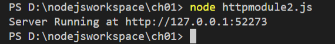

<br>

※ createServer()안에 작성되는 함수의 인자는 다음과 같다.

request : IncomingMessage

response : ServerResponse

<br><br>

### 3-2. response 객체

```javascript
require('http').createServer((request, response)=>{
  response.writeHead(200, {'content-type': 'text/html; charset=utf-8'}); 
  // 한글화 하려면 charset=utf-8 필수
  response.write('<h1>Hello Node !</h1>'); 
  // 스트림 형식으로 작성
  response.end('<p>hello web server with node.js</p>');
  
}).listen(52273, function(){
  console.log('Server Running at http://127.0.0.1:52273');
});
//브라우저를 실행하고, URL입력줄에 http://127.0.0.1:52273 엔터
```

터미널 명령 결과 : 
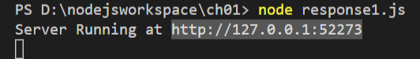

브라우저 결과 :
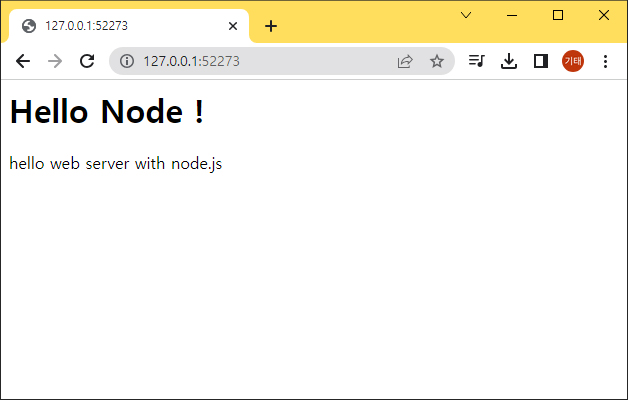

<br>

#### 3-2-1. File System 모듈 사용해 웹페이지 제공하기

httpFile.js 파일에 서버 생성

```javascript
var http = require('http');
var fs = require('fs');

http.createServer(function(request, response){
  fs.readFile('htmlPage.html', function(error, data){
    response.writeHead(200, {'Content-Type': 'text/html'});
    response.end(data);
  });
}).listen(52273, function(){
  console.log('Server Running at http://127.0.0.1:52273');
});
```

<br>

htmlPage.html 로 출력 파일 생성하기

```html
<!DOCTYPE html>
<html lang="en">
<head>
  <meta charset="UTF-8">
  <meta http-equiv="X-UA-Compatible" content="IE=edge">
  <meta name="viewport" content="width=device-width, initial-scale=1.0">
  <title>별도의 html문서</title>
</head>
<body>
  <h1>Hello Node.js</h1>
  <h2>Author. KimKitae</h2>
  <hr>
  <p>Lorem ipsum dolor sit amet consectetur adipisicing elit. Perspiciatis dolor doloribus consequatur iure ducimus fuga totam molestiae nisi perferendis possimus, voluptatibus atque esse assumenda dolores, aut est saepe id voluptates!</p>
</body>
</html>
```

터미널 명령 결과 : 
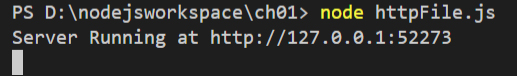

브라우저 결과 :
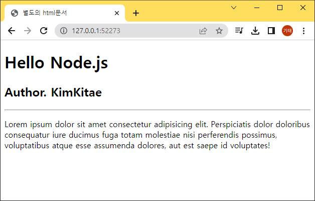

httpFile.js 실행 후 해당 url 실행하기.

<br>

#### 3-2-2. 이미지 파일 출력하기

httpImageFile.js

```javascript
var fs = require('fs');
var http = require('http');

http.createServer(function(request,response){
    fs.readFile('../images/kimkitae.jpg',function(error,data){
        //가져올 타입이 이미지이면 Content-Type:image/jpeg
        response.writeHead(200,{'Content-Type':'image/jpeg'});
        response.end(data);
    })
}).listen(7777,function(){
    console.log('Server Running at http://127.0.0.1:7777')
});

//사이트를 두개 만들고 싶으면 포트번호를 꼭 다르게 만들어야 함
http.createServer(function(request,response){
    fs.readFile('htmlPage.html',function(error,data){
        //가져올 타입이 이미지이면 Content-Type:image/jpeg
        response.writeHead(200,{'Content-Type':'text/html'});
        response.end(data);
    })
}).listen(7778,function(){
    console.log('Server Running at http://127.0.0.1:7778')
});
```

터미널 명령 결과 : 
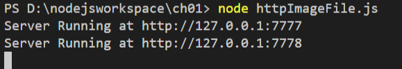

브라우저 결과 :
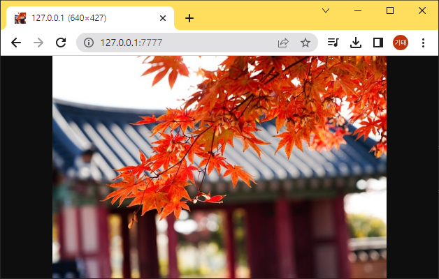


<br>

#### 3-2-3. 쿠키 사용하기

httpCookie.js

```javascript
var http = require('http');

http.createServer(function(request, response){
    response.writeHead(200,{
        'Content-Type':'text/html',
        'Set-Cookie':['name = kimkitae','age = 38']
    })
    response.end('<h1>' + request.headers.cookie + '</h1>')
}).listen(52273, function(){
    console.log('Server Running at http://127.0.0.1:52273');
});
```

터미널 명령 결과 : 
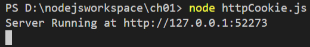

브라우저 결과 :
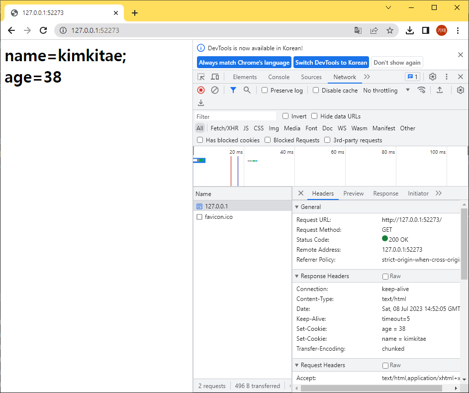