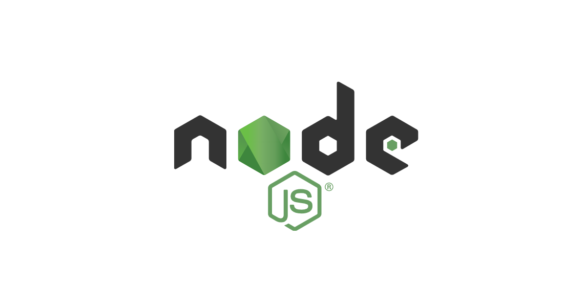
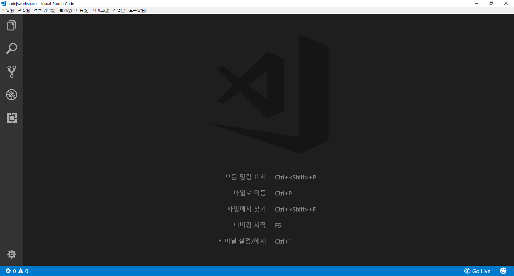

# Nodejs + VisualStudioCode + Express + MySql 프로젝트


## 1. Visual Studio Code 에서 NodeJS 진행하기 



1-1) nodejsworkspace 워크스페이스 폴더 생성하고 Visul Studio Code 열기



1-2) 보기 메뉴 -> 통합 터미널


1-3) 터미널에서 노드 확인하기
```command
    node -v
```

1-4) start.js로 다음 내용을 작성 후 저장
```javascript
console.log("Hello Node Javascript")
```

1-5) 터미널에서 실행하기
```command
    D:\nodejsworkspace>node start.js
```

1-6) start.js에 전역변수 설정 후 다시 터미널에서 실행하기
```javascript
//전역변수 설정
__filename = "data1.dat"
__dirname = "data"

console.log("파일경로 : "+__dirname+"/"+__filename)
```
```command
    D:\nodejsworkspace>node start.js
```

1-7) module.js 파일이름으로 모듈 작성하기
```javascript
exports.abs = function(number) {
  if(0 < number){
    return number;
  }else{
    return -number;
  }
}
exports.circleArea = function(radius){
  return radius * radius * Math.PI
}
```

1-8) main.js 파일에서 기작성된 module.js를 가져와 실행하기
```javascript
var module = require('./module.js');
console.log('abs(-273) = %d', module.abs(-273));
console.log('circleArea(3) = %d', module.circleArea(3));
```
```command
    D:\nodejsworkspace>node main.js
```

결과 : 


------------------------------------------------------


## 2. NodeJS에서 제공하는 기본 모듈

### 2-1. url 모듈

실습1) 아래와 같이 url 모듈을 활용하는 예제를 작성하여 urlmodule.js 로 저장한 후 실행하기
```javascript
const { parse } = require('path');
var url = require('url');

var parseObject = url.parse('http://www.hanbit.co.kr/store/books/look.php?p_code= B4250257160');
console.log(parseObject);
```  
```command
    D:\nodejsworkspace>node urlmodule.js
```

결과 :


<br><br>

### 2-2. querystring 모듈

실습1) 아래와 같이 querystring.js 로 저장한 후 실행하기
```javascript
const { parse } = require('path');

//URL
var url = require('url');

var parseObject = url.parse('http://www.hanbit.co.kr/store/books/look.php?p_code= B4250257160');
// console.log(parseObject);

//쿼리스트링
var querystring = require('querystring');
console.log(querystring.parse(parseObject.query));
```  
```command
    D:\nodejsworkspace>node querystring.js
```

결과 :


<br><br>

### 2-3. crypto 모듈

실습1) 아래와 같이 cripto.js 로 저장한 후 실행하기

```javascript
var crypto = require('crypto');

var key = '비밀키';
var input = 'kim';

var cipher = crypto.createCipher('aes192', key);
cipher.update(input, 'utf-8', 'base64');
var cipheredOutput = cipher.final('base64');

console.log('원래 문자열 : ' + input);
console.log('암호화 : ' + cipheredOutput);

var decipher = crypto.createDecipher('aes192', key);
decipher.update(cipheredOutput, 'base64', 'utf-8');
var decipheredOutput = decipher.final('utf-8');

console.log('복호화 : ' + decipheredOutput);
```

결과 :


<br><br>

### 2-4. fs 모듈 (file system)

#### 2-4-1. 비동기 방식 메서드
```
fs.readFile(filename, [options], callback)
fs.writeFile(filename, data, [options], callback)
```

#### 2-4-2. 동기 방식 메서드
```
fs.readFileSync(filename, [options])
fs.writeFileSync(filename, data, [options])
```

#### 2-4-3. read
readFileSync는 동기 처리
readFile은 비동기 처리

실습1) 아래와 같이 fsread.js 로 저장한 후 실행하기

```javascript
var fs = require('fs');

var text = fs.readFileSync('textfile.txt', 'utf-8');
console.log(text);

fs.readFile('textfile.txt', 'utf-8', (error, data) => {
  console.log(data);
})
```

결과 : 


#### 2-4-4. write
writeFileSync는 동기 처리
writeFile은 비동기 처리

실습2) 아래와 같이 fswrite.js 로 저장한 후 실행하기

```javascript
var fs = require('fs');
var data = "안녕하세요 김기태대왕..!";

fs.writeFile('TextFileWrite.txt', data, 'utf-8', function(error){
  console.log('write');
});

fs.writeFileSync('TextFileWriteSync.txt', data, 'utf-8');
console.log('write_sync');
```

※ 예외처리
동기(Sync) 메서드는 결과값을 반환하고, 예외를 일으킬 수 있다. 비동기(Async) 메서드는 마지막 인자로 콜백함수를 받고, 아무 값도 반환하지 않는다.
동기 방식은 에러 메시지를 따로 받지 않으므로 try~catch 구문을 사용해 처리해야 한다.
비동기 방식은 인자로 받는 callback 함수의 매개변수인 error에 예외가 전달되므로 try~catch 구문을 사용할 필요가 없다.

<br><br>

결과 : 


위와 같이 현재 디렉토리에 TextFileWrite.txt와 TextFileWriteSync.txt의 2개 파일이 만들어진다.

<br><br>

### 2-5. event 모듈

실습1) 아래와 같이 event1.js 로 저장한 후 실행하기

```javascript
const EventEmitter = require('events');
var custom = new EventEmitter();

custom.on('tick', function(code){
  console.log('이벤트가 실행되었습니다.')
})

//emit: 강제로 해당 이벤트를 발생시킨다.
custom.emit('tick');
```

결과 : 


#### 2.5-1. 파일 분리해서 사용하기

실습2) 아래와 같이 rint.js와 app.js를 작성하여 실행하기 

rint.js (이벤트 생성)
```javascript
const EventEmitter = require('events');
var custom = new EventEmitter();
setInterval(()=>{
  exports.timer.emit('tick');
}, 1000);
```

app.js (실행)
```javascript
const rint = require('rint');
rint.timer.on('tick', function(code){
  console.log('이벤트를 실행했습니다.');
})
```

node app.js를 입력하면 '이벤트를 실행했습니다'가 1초에 한 번씩 콘솔에 찍히게 된다.

<br><br><br>

## 3. 웹(http) 모듈 - ch01

### 3-1. 서버의 시작과 종료

실습1) 아래 내용을 ch01/httpmodule1.js 에 작성하고, 실행하기

```javascript
//http 모듈 추출 (import)
const http = require('http');

//웹 서버 생성
const server = http.createServer();

//포트 설정 - 넉넉하게 큰 번호를 써 주면 충돌할 일이 없다. 
//서버가 실행되면 콘솔에 출력되도록 한다.
server.listen(52273, ()=>{ 
  console.log('Server Running at http://127.0.0.1:52273');
}); 

//20초 후 서버 종료
setTimeout(function(){
    console.log('서버 종료');
    server.close();
  }, 20000);
```

결과 : 


<br>

실습2) 아래 내용을 ch01/httpmodule2.js 에 작성하고, 실행하기

```javascript
//모듈 로딩과 웹 서버 생성을 동시에
require('http').createServer().listen(52273, function(){
  console.log('Server Running at http://127.0.0.1:52273');
})
//서버 종료는 ctrl+c 로 종료시킴
```

결과 : 


<br>

※ createServer()안에 작성되는 함수의 인자는 다음과 같다.

request : IncomingMessage

response : ServerResponse

<br><br>

### 3-2. response 객체

```javascript
require('http').createServer((request, response)=>{
  response.writeHead(200, {'content-type': 'text/html; charset=utf-8'}); 
  // 한글화 하려면 charset=utf-8 필수
  response.write('<h1>Hello Node !</h1>'); 
  // 스트림 형식으로 작성
  response.end('<p>hello web server with node.js</p>');
  
}).listen(52273, function(){
  console.log('Server Running at http://127.0.0.1:52273');
});
//브라우저를 실행하고, URL입력줄에 http://127.0.0.1:52273 엔터
```

터미널 명령 결과 : 


브라우저 결과 :


<br>

#### 3-2-1. File System 모듈 사용해 웹페이지 제공하기

httpFile.js 파일에 서버 생성

```javascript
var http = require('http');
var fs = require('fs');

http.createServer(function(request, response){
  fs.readFile('htmlPage.html', function(error, data){
    response.writeHead(200, {'Content-Type': 'text/html'});
    response.end(data);
  });
}).listen(52273, function(){
  console.log('Server Running at http://127.0.0.1:52273');
});
```

<br>

htmlPage.html 로 출력 파일 생성하기

```html
<!DOCTYPE html>
<html lang="en">
<head>
  <meta charset="UTF-8">
  <meta http-equiv="X-UA-Compatible" content="IE=edge">
  <meta name="viewport" content="width=device-width, initial-scale=1.0">
  <title>별도의 html문서</title>
</head>
<body>
  <h1>Hello Node.js</h1>
  <h2>Author. KimKitae</h2>
  <hr>
  <p>Lorem ipsum dolor sit amet consectetur adipisicing elit. Perspiciatis dolor doloribus consequatur iure ducimus fuga totam molestiae nisi perferendis possimus, voluptatibus atque esse assumenda dolores, aut est saepe id voluptates!</p>
</body>
</html>
```

터미널 명령 결과 : 


브라우저 결과 :


httpFile.js 실행 후 해당 url 실행하기.

<br>

#### 3-2-2. 이미지 파일 출력하기

httpImageFile.js

```javascript
var fs = require('fs');
var http = require('http');

http.createServer(function(request,response){
    fs.readFile('../images/kimkitae.jpg',function(error,data){
        //가져올 타입이 이미지이면 Content-Type:image/jpeg
        response.writeHead(200,{'Content-Type':'image/jpeg'});
        response.end(data);
    })
}).listen(7777,function(){
    console.log('Server Running at http://127.0.0.1:7777')
});

//사이트를 두개 만들고 싶으면 포트번호를 꼭 다르게 만들어야 함
http.createServer(function(request,response){
    fs.readFile('htmlPage.html',function(error,data){
        //가져올 타입이 이미지이면 Content-Type:image/jpeg
        response.writeHead(200,{'Content-Type':'text/html'});
        response.end(data);
    })
}).listen(7778,function(){
    console.log('Server Running at http://127.0.0.1:7778')
});
```

터미널 명령 결과 : 


브라우저 결과 :


<br>

#### 3-2-3. 쿠키 사용하기

httpCookie.js

```javascript
var http = require('http');

http.createServer(function(request, response){
    response.writeHead(200,{
        'Content-Type':'text/html',
        'Set-Cookie':['name = kimkitae','age = 38']
    })
    response.end('<h1>' + request.headers.cookie + '</h1>')
}).listen(52273, function(){
    console.log('Server Running at http://127.0.0.1:52273');
});
```

터미널 명령 결과 : 


브라우저 결과 :


### 3-3. request 객체

#### 3-3-1. URL 사용하기

index.html

```html
<!DOCTYPE html>
<html lang="en">
<head>
  <meta charset="UTF-8">
  <meta http-equiv="X-UA-Compatible" content="IE=edge">
  <meta name="viewport" content="width=device-width, initial-scale=1.0">
  <title>Document</title>
</head>
<body>
  <h1>Hello Node.js</h1>
  <h2>Author. RintIanTta</h2>
  <hr>
  <p>Lorem ipsum dolor sit amet consectetur adipisicing elit. Perspiciatis dolor doloribus consequatur iure ducimus fuga totam molestiae nisi perferendis possimus, voluptatibus atque esse assumenda dolores, aut est saepe id voluptates!</p>
</body>
</html>
```

OtherPage.html

```html
<!DOCTYPE html>
<html lang="en">
<head>
  <meta charset="UTF-8">
  <meta http-equiv="X-UA-Compatible" content="IE=edge">
  <meta name="viewport" content="width=device-width, initial-scale=1.0">
  <title>Document</title>
</head>
<body>
  <p>Other Page</p>
</body>
</html>
```

app.js

```javascript
var http = require('http');
var fs = require('fs');
var url = require('url');

//서버 생성 및 실행
http.createServer(function(request, response){
  //변수 선언
  var pathname = url.parse(request.url).pathname;

  //페이지 구분
  if(pathname == '/'){
    fs.readFile('index.html', function(error, data){
      response.writeHead(200, {'Content-Type':'text/html'});
      response.end(data);
    });
  }else if(pathname == '/OtherPage'){
    fs.readFile('OtherPage.html', function(error, data){
      response.writeHead(200, {'Content-Type':'text/html'});
      response.end(data);
    })
  }

}).listen(52273, function(){
  console.log('Server Running at http://127.0.0.1:52273');
})
```

실행 후 주소창 끝에 /OtherPage를 붙여 실행하면 OtherPage 화면을 확인할 수 있다.

#### 3-3-2. method 속성

app.js

```javascript
var http = require('http');

http.createServer(function(request, response){

  if(request.method == 'GET'){
    console.log('GET 요청입니다.');
  }else if(request.method == 'POST'){
    console.log('POST 요청입니다.');
  }

}).listen(52273, ()=>{
  console.log('Server Running at http://127.0.0.1:52273');
})
```

위 파일을 실행하면 콘솔에 GET요청이 찍힌다. 웹 브라우저에 URL을 입력하는 것만으로는 POST요청을 수행할 수 없다.

#### 3-3-3. GET 요청 매개변수 추출하기

```javascript
var http = require('http');
var url = require('url');

http.createServer(function(request, response){
  //요청 매개변수 추출
  var query = url.parse(request.url, true).query;

  //GET 요청 매개변수 출력
  response.writeHead(200, {'Content-Type': 'text/html'});
  response.end('<h1>' + JSON.stringify(query) + '</h1>');
}).listen(52273, ()=>{
  console.log('Server Running at http://127.0.0.1:52273');
})
```

위 코드 실행 후 아래 주소를 입력해 실행한다.
http://127.0.0.1:52273?name=kimkitae&region=sejong

JSON형태로 쿼리스트링에 입력한 데이터가 출력된다.


#### 3-3-4. POST 요청 매개변수 추출하기

htmlPage2.html

```html
<!DOCTYPE html>
<html lang="en">
<head>
  <meta charset="UTF-8">
  <meta http-equiv="X-UA-Compatible" content="IE=edge">
  <meta name="viewport" content="width=device-width, initial-scale=1.0">
  <title>POST 폼 전송</title>
</head>
<body>
  <form method="post">
    <table>
      <tr>
        <td><label for="">Data A</label></td>
        <td><input type="text" name="data_a"></td>
      </tr>
      <tr>
        <td><label for="">Data B</label></td>
        <td><input type="text" name="data_b"></td>
      </tr>
    </table>
    <input type="submit">
  </form>
</body>
</html>
```

request.post.js

```javascript
var http = require('http');
var fs = require('fs');

http.createServer(function(request, response){

  if(request.method == 'GET'){
    //GET 요청
    fs.readFile('method_htmlPage.html', (error, data)=>{
      response.writeHead(200, {'Content-Type': 'text/html'});
      response.end(data);
    });
  }else if(request.method == 'POST'){
    //POST 요청
    request.on('data', function(data){
      response.writeHead(200, {'Content-Type':'text/html'});
      response.end('<h1>' + data + '</h1>');
    });
  }
}).listen(52273, function(){
  console.log('Server Running at http://127.0.0.1:52273');
})
```

실행 후 입력 폼이 뜨면 적당한 값을 입력하고 제출한다. data_a = & data_b = 형태의 값이 출력된다.

#### 3-3-5. 간단한 쿠키 사용과 출력

```javascript
var http = require('http');

http.createServer(function(request, response){
  //GET COOKIE
  var cookie = request.headers.cookie;

  //SET COOKIE
  response.writeHead(200, {
    'Content-Type': 'text/html',
    'Set-Cookie': ['name = RintIanTta', 'region = Seoul']
  });

  //응답
  response.end('<h1>' + JSON.stringify(cookie) + '</h1>');
}).listen(52273, function(){
  console.log('Server Running at http://127.0.0.1:52273');
})
```

#### 3-3-6. 쿠키 추출하고 분해하기

```javascript
var http = require('http');

http.createServer(function(request, response){

  //쿠키가 있는지 확인
  if(request.headers.cookie){
    //쿠키를 추출하고 분해
    var cookie = request.headers.cookie.split(';').map(function(element){
      var element = element.split('=');
      return {
        key: element[0],
        value: element[1]
      }
    })

    //응답
    response.end('<h1>' + JSON.stringify(cookie) + '</h1>');
  }else{
    //쿠키 생성
    response.writeHead(200, {
      'Content-Type': 'text/html; charset=utf-8',
      'Set-Cookie':['name = RintIanTta', 'region = Seoul']
    });

    //응답
    response.end('<h1>쿠키를 생성했습니다.</h1>')
  }
}).listen(52273, function(){
  console.log('Server Running at http://127.0.0.1:52273');
})
```

<br><br>

## 4. 외부 모듈

### 4-1. ejs 모듈

터미널에 다음 명령을 입력해 ejs 모듈을 설치한다.

```command
npm install ejs
```


사용할 때는 다음과 같이 모듈을 추출한다.

```javascript
var ejs = require('ejs');
```

ejs.js와 ejsPage.ejs 파일을 만든다.

ejs.js

```javascript
var http = require('http');
var fs = require('fs');
var ejs = require('ejs');

http.createServer(function(request, response){
  //ejsPage.ejs파일 읽기
  fs.readFile('ejsPage.ejs', 'utf8', function(error, data){
    response.writeHead(200, {'Content-Type': 'text/html'});
    response.end(ejs.render(data));
  });

}).listen(52273, function(){
  console.log('Server Running at http://127.0.0.1:52273');
})
```

ejsPage.ejs

```javascript
<% var name = 'RintIanTta';%>
<h1><%= name %></h1>
<p><%= 52 * 273 %></p>
<hr>
<% for(var i=0; i<10; i++) { %>
  <h2>The Square of <%= i %> is <%= i * i %></h2>
<% } %>
```

결과 화면


### 4-2. jade 모듈

마찬가지로 npm install jade를 입력해 설치한다.

package.json 파일에서 다음과 같이 설치된 것을 확인할 수 있다.


jade.js와 jadePage.jade 파일을 만든다.

jadePage.jade

jade에서는 들여쓰기로 태그 구조를 형성한다.

```jade
html
html
  head
    title Index Page
  body 
    //jade 주석
    #header //id, class만 입력해도 div태그가 생성된다.
      h1 Hello Jade 
      h2 Lorem ipsum
    hr
    .article 
      p Lorem ipsum dolor sit amet consectetur adipisicing elit. Error ab labore obcaecati similique a nesciunt, quo beatae temporibus cupiditate inventore ex unde vero veritatis nostrum maiores explicabo ipsum dolor eos?
      hr졸음
      a(href="https://www.naver.com") Go To Naver
```

jade.js


#### 4-2-1. 웹 서버 생성 및 실행

```javascript
//모듈 추출
var http = require('http');
var fs = require('fs');

//서버 생성하고 실행
http.createServer(function (request, response) {
  //JadePage.jade 파일 읽기
  fs.readFile('JadePage.jade', 'utf8', (error, data)=>{

  });
}).listen(52273, ()=>{
  console.log('Server Running at http://127.0.0.1:52273');
});
```

#### 4-2-2. compile()메서드 사용

compile(string, option)메서드는 JADE문자열을 HTML문자열로 변환할 수 있는 함수를 생성한다.

```javascript
//모듈 추출
var http = require('http');
var jade = require('jade');
var fs = require('fs');

//서버 생성하고 실행
http.createServer(function (request, response) {
  //JadePage.jade 파일 읽기
  fs.readFile('JadePage.jade', 'utf8', (error, data)=>{

    //jade모듈 사용해 함수 생성
    var fn = jade.compile(data);

    //출력
    response.writeHead(200, { 'Content-Type': 'text/html' });
    response.end(fn());

  });
}).listen(52273, ()=>{
  console.log('Server Running at http://127.0.0.1:52273');
});
```

### 4-3. supervisor 모듈

Node.js 개발을 하다 보면 node app.js과 Ctrl + c를 반복 입력하게 된다. supervisor 모듈을 사용하면 파일의 변경사항을 자동으로 인식하고 실행 종료 후 다시 실행해준다.

다음 명령을 입력해 설치한다.

```command
npm install -g supervisor
```

콘솔에 supervisor를 입력해 기본 명령어를 확인할 수 있다.

파일을 supervisor모듈로 실행하려면 node filename.js 대신 supervisor filename.js를 입력해 실행하면 된다. 파일이 저장되면 자동으로 변경된 문자열을 출력한다.

서버 프로그램을 실행할 때만 supervisor 모듈을 사용해야 한다. 모듈은 어떤 Node.js프로그램이든 다시 실행시킨다. 프로세스가 종료되면 무한 반복 실행되므로 주의하자.

### 4-4. forever 모듈

기존 멀티스레드 기반의 웹 서비스는 예외가 발생해도 전체 웹 서비스에 크게 영향을 주지 않지만, Node.js같은 단일 스레드 기반의 웹 서비스는 예외 하나로 웹 서비스 전체가 죽어버린다. 이러한 예외 상황을 대비해 forever모듈을 사용할 수 있다.

다음 코드로 설치한다.

```command
npm install -g forever
```

명령어 예시는 forever를 입력해 확인한다.
forever 모듈로 웹 서버를 실행할 때는 다음 명령을 사용한다.

```command
forever start app.js
```

현재 실행되고 있는 웹 서버를 확인할 때는 list명령어를 사용한다.

```command
forever list
```

위 명령어로 확인한 프로세스의 번호로 서버를 종료한다. stop 명령어를 사용한다.

```command
forever stop 0
```

## 5. express 모듈

myapp과 같은 디렉토리를 만들고 다음 명령어로 express를 설치한다.

```command
npm init //초기화
npm install express
```

### 5-1. 웹 서버 생성과 실행

express 모듈은 express() 함수로 애플리케이션 객체를 생성하고, listen() 함수로 웹 서버를 설정 및 실행한다.

```javascript
// 모듈을 추출합니다.
var http = require('http');
var express = require('express');

// 서버를 생성합니다.
var app = express();

// request 이벤트 리스너를 설정합니다.
app.use(function (request, response) {
    response.writeHead(200, { 'Content-Type': 'text/html' });
    response.end('<h1>Hello express</h1>');
});

// 서버를 실행합니다.
http.createServer(app).listen(52273, function () {
    console.log('Server running at http://127.0.0.1:52273');
});
```

### 5-2. 기본 응답 메서드

request 이벤트리스너의 매개변수에는 request와 reasponse객체가 들어간다. express모듈로 서버를 생성하면 request객체와 response객체에 다양한 기능이 추가된다.

#### 5-2-1. response 객체의 메서드


| 메서드 | 설명 |
|---------------|-------------------------------|
| response.send | 매개변수 자료형에 따라 적절한 형태로 응답 |
| json | json형태로 응답 |
| jsonp | jsonp형태로 응답 |
| redirect | 웹페이지 경로를 강제로 이동 |


#### 5-2-2. send() 사용하기

```javascript
// 모듈을 추출합니다.
var http = require('http');
var express = require('express');

// 서버를 생성합니다.
var app = express();

// request 이벤트 리스너를 설정합니다.
app.use(function (request, response) {
    // 데이터를 생성합니다.
    var output = [];
    for (var i = 0; i < 3; i++) {
        output.push({
            count: i,
            name: 'name - ' + i
        })
    }

    // 응답합니다.
    response.send(output);
});

// 서버를 실행합니다.
http.createServer(app).listen(52273, function () {
    console.log('Server running at http://127.0.0.1:52273');
});
```

### 5-3. 미들웨어

http모듈로 만든 서버와 express모듈로 만든 서버의 가장 큰 차이점은 express 모듈은 request 이벤트 리스너를 연결하는 데 use()메서드를 사용한다는 것이다. use()는 여러 번 사용할 수 있다. use()메서드의 매개변수에는 function(request, response, next){} 형태의 함수를 입력한다. 매개변수 next는 다음에 위치하는 함수를 의미한다.

요청 응답을 완료하기 전까지 요청 중간중간에 여러 가지 일을 처리할 수 있다. 그래서 use()메서드의 매개변수에 입력하는 함수를 미들웨어(middleware)라고 부른다.

```javascript
// 모듈을 추출합니다.
var express = require('express');

// 서버를 생성합니다.
var app = express();

// 미들웨어를 설정합니다.
app.use(function (request, response, next) {
  // 데이터를 추가합니다.
  request.number = 52;
  response.number = 273;
  next();
});

// 미들웨어를 설정합니다.
app.use(function (request, response, next) {
  // 응답합니다.
  response.send('<h1>' + request.number + ' : ' + response.number + '</h1>');
});
// 서버를 실행합니다.
app.listen(52273, function () {
  console.log("Server Running at http://127.0.0.1:52273");
});
```

### 5-4. router 미들웨어

페이지 라우팅은 express 모듈에 내장된 미들웨어의 기능으로, 클라이언트 요청에 적절한 페이지를 제공하는 기술이다. (URL 주소마다 페이지를 분할)

```javascript
// 모듈을 추출합니다.
var express = require('express');

// 서버를 생성합니다.
var app = express();

// 라우터를 설정합니다.
app.get('/favicon.ico', (req, res) => res.status(204));
app.get('/page/:id', function (request, response) {
  // 변수를 선언합니다.
  var name = request.params.id;

  // 응답합니다.
  response.send('<h1>' + name + ' Page</h1>');
});
// 서버를 실행합니다.
app.listen(52273, function () {
  console.log("Server Running at http://127.0.0.1:52273");
});
```

실행 주소
http://127.0.0.1:52273/page/255
=> 255 Page가 출력된다.

```javascript
// 모듈을 추출합니다.
var http = require('http');
var express = require('express');

// 서버를 생성합니다.
var app = express();

// 미들웨어를 설정합니다.
app.use(express.logger());
app.use(app.router);

// 라우터를 설정합니다.
app.get('/page/:id', function (request, response) {
    // 변수를 선언합니다.
    var name = request.param('id');

    // 응답합니다.
    response.send('<h1>' + name + ' Page</h1>');
});

// 서버를 실행합니다.
http.createServer(app).listen(52273, function () {
    console.log('Server running at http://127.0.0.1:52273');
});
```

### 5-5. static

```javascript
// 모듈을 추출합니다.
var http = require('http');
var express = require('express');

// 서버를 생성합니다.
var app = express();

// 미들웨어를 설정합니다.
app.use(express.static(__dirname + '/public'));
app.use(function (request, response) {
    // 응답합니다.
    response.writeHead(200, { 'Content-Type': 'text/html' });
    response.end('');
});

// 서버를 실행합니다.
http.createServer(app).listen(52273, function () {
    console.log('Server running at http://127.0.0.1:52273');
});
```

### 5-6. cookie parser

```javascript
//모듈을 추출한다.
var http = require('http');
var express = require('express');
var cookieParser = require('cookie-parser'); //express 4.x부터 express.cookieParser()가 사용되지 않으므로 이것으로 사용한다.

//서버를 생성한다.
var app = express();

//미들웨어를 설정한다.
//app.use(express.cookieParser()); //express 4.x부터 사용하지 않는다.
//app.use(app.router); //express 4.x부터 사용하지 않는다.
app.use(cookieParser()); //express 4.x부터 express.cookieParser()가 사용되지 않으므로 이것으로 사용한다.

//라우터를 설정한다.
app.get('/getCookie', function (request, response) {
  //응답한다.    
  response.send(request.cookies);
});
app.get('/setCookie', function (request, response) {
  //쿠키를 생성한다.    
  response.cookie('string', 'cookie');
  response.cookie('json', {
    name: 'cookie',
    property: 'delicious'
  });
  
  //응답한다.    
  response.redirect('/getCookie');
});

//서버를 실행한다.
http.createServer(app).listen(52273, function (request, response) {
  console.log('Server running at http://127.0.0.1:52273');
});
```


```javascript
// 모듈을 추출합니다.
var fs = require('fs');
var http = require('http');
var express = require('express');

// 서버를 생성합니다.
var app = express();

// 미들웨어를 설정합니다.
app.use(express.cookieParser());
app.use(express.bodyParser());
app.use(app.router);

// 라우터를 설정합니다.
app.get('/', function (request, response) {
    if (request.cookies.auth) {
        response.send('<h1>Login Success</h1>');
    } else {
        response.redirect('/login');
    }
});
app.get('/login', function (request, response) {
    fs.readFile('login.html', function (error, data) {
        response.send(data.toString());
    });
});
app.post('/login', function (request, response) {
    // 쿠키를 생성합니다.
    var login = request.param('login');
    var password = request.param('password');

    // 출력합니다.
    console.log(login, password);
    console.log(request.body);

    // 로그인을 확인합니다.
    if (login == 'rint' && password == '1234') {
        // 로그인 성공
        response.cookie('auth', true);
        response.redirect('/');
    } else {
        // 로그인 실패
        response.redirect('/login');
    }
});

// 서버를 실행합니다.
http.createServer(app).listen(52273, function () {
    console.log('Server running at http://127.0.0.1:52273');
});
```

### 5-7. connect-multiparty 미들웨어

multipart.app.js

```javascript
var express = require('express');
var cookieParser = require('cookie-parser');
var bodyParser = require('body-parser');
var fs = require('fs');
var multipart = require('connect-multiparty');

//서버 생성
var app = express();

//쿠키 미들웨어 설정
app.use(cookieParser());

//body parser 미들웨어 설정
app.use(bodyParser.urlencoded({extended:false}));

//multipart 미들웨어 설정
app.use(multipart({uploadDir: __dirname + '/multipart'}));

//미들웨어
//request 이벤트 리스너
//use()
//app.get('/favicon.ico', (req, res) => res.status(204));

app.get('/', function(request, response){
  fs.readFile('multipart.html', function(error, data){
    response.send(data.toString());
  })
});

app.post('/', function(request, response){
  //console.log(request.body);
  //console.log(request.files);

  var comment = request.body.comment;
  var imageFile = request.files.image;

  if(imageFile){
    //변수 선언 - 파일이름, 파일경로, 파일유형
    var name = imageFile.name;
    var path = imageFile.path;
    var type = imageFile.type;

    console.log(name);

    //이미지 파일인지 확인(속성값에 image라는 단어가 포함되어 있는지)
    if(type.indexOf('image') != -1){
      //이미지 파일인 경우 파일 이름을 변경한다.
      var outputPath = __dirname + '/multipart/' + Date.now() + '_' + name; // + comment 이렇게 코멘트 추가할 수도(name에 확장자가 포함되어 있으니 name을 맨 마지막에 추가해야 함)
      //파일 pathname을 path에서 outputPath로 변경
      fs.rename(path, outputPath, function(error){
        response.redirect('/');
      });
    }
  }else{
    // 이미지 파일이 아닌 경우 파일이름을 제거한다. 
    fs.unlink(path, function(error){
      response.sendStatus(404);
    })
   
  }
});

app.listen(52273, function(){
  console.log("Server Running at http://127.0.0.1:52273");
});
```

multipart.html

```html
<!DOCTYPE html>
<html>
<head>
    <title>Multipart Upload</title>
</head>
<body>
    <h1>File Upload</h1>
    <form method="post" enctype="multipart/form-data">
        <table>
            <tr>
                <td>Comment: </td>
                <td><input type="text" name="comment" /></td>
            </tr>
            <tr>
                <td>File: </td>
                <td><input type="file" name="image" /></td>
            </tr>
        </table>
        <input type="submit" />
    </form>
</body>
</html>
```

### 5-8. express-session 미들웨어

express-session 설치

```command
npm install express-session --save
```

session.app.js

```javascript
var express = require('express');
var session = require('express-session');

var app = express();

app.use(session({
  //secret: 세션을 암호화하여 저장
  secret: 'secret key',
  //resave: 세션을 변경되지 않아도 항상 저장할지 - false 권장.
  resave: false,
  //saveUninitialized: 세션이 저장되기 전에 uninitialized 상태로 미리 만들어서 저장
  saveUninitialized: true,
  cookie: {
    maxAge: 60 * 1000
  }
}))

app.use(function(request, response){
  //request.session.now = (new Date()).toUTCString();
  //response.send(request.session);
  //변수 선언
  var output = {};
  output.cookies = request.cookies;
  output.session = request.session;
  
  //세션 저장
  request.session.now = (new Date()).toUTCString();
  
  //응답
  response.send(output);
});

app.listen(52273, function(){
  console.log('Server running at http://127.0.0.1:52273');
});
```

<br>

### 5-9. RESTful 웹 서비스 개발

GET :    /user 모든 사용자의 정보를 조회
GET :   /user/:id 특정 사용자의 정보를 조회
POST :   /user 사용자를 추가
PUT :   /user/:id 특정 사용자의 정보를 수정
DELETE :   /user/:id 특정 사용자의 정보를 삭제

아래는 CRUD를 구현한 코드.

app.js

```javascript
var express = require('express');
var fs = require('fs');
var bodyParser = require('body-parser');
const { Http2ServerRequest } = require('http2');
const { throws } = require('assert');

//더미 데이터베이스 구현
var DummyDB = (function(){
  //변수 선언
  var DummyDB = {};
  var storage = [];
  var count = 1;

// 메서드를 구현합니다.
DummyDB.get = function (id) {
  if (id) {
      // 변수를 가공합니다.
      id = (typeof id == 'string') ? Number(id) : id;

      // 데이터를 선택합니다.
      for (var i in storage) if (storage[i].id == id) {
          return storage[i];
      }
  } else {
      return storage;
  }
};

DummyDB.insert = function (data) {
  data.id = count++;
  storage.push(data);
  return data;
};

DummyDB.remove = function (id) {
  // 변수를 가공합니다.
  id = (typeof id == 'string') ? Number(id) : id;

  // 제거합니다.
  for (var i in storage) if (storage[i].id == id) {
      // 데이터를 제거합니다.
      storage.splice(i, 1);

      // 리턴합니다: 데이터 삭제 성공
      return true;
  }

  // 리턴합니다: 데이터 삭제 실패
  return false;
};

// 리턴합니다.
return DummyDB;
})();

//서버 생성
var app = express();

app.use(bodyParser.urlencoded({extended:false}));

//라우터 미들웨어 설정
app.get('/user', function(request, response){
  response.send(DummyDB.get());
});
app.get('/user/:id', function(request, response){
  response.send(DummyDB.get(request.params.id));
});
app.post('/user', function(request, response){
  var name = request.body.name;
  var region = request.body.region;

  if(name && region){
    response.send(DummyDB.insert({name:name, region:region}))
  }else{
    throw new Error('error');
  }
});
app.put('/user/:id', function(request, response){
  var id = request.params.id;
  var name = request.body.name;
  var region = request.body.region;

  var item = DummyDB.get(id);
  item.name = name || item.name;
  item.region = region || item.region;

  // 응답합니다.
  response.send(item);
});
app.delete('/user/:id', function(request, response){
  response.send(DummyDB.remove(request.params.id));
});

//서버 실행 
app.listen(52273, function(){
  console.log('Server running at http://127.0.0.1:52273');
})
```

위 코드에서 DummyDB는 즉시 실행 함수 표현으로 정의되었다.

#### 5-9-1. Immediately-invoked Function Expression (즉시 실행 함수 표현)

```comment
var myfunc = (function(){
  //...
})()
```

정의되자마자 즉시 실행되는 자바스크립트 함수.
표현 내부 변수는 외부로부터의 접근이 불가능하다. (통제할 수 있다)
변수에 할당할 경우 함수는 저장되지 않고 결과만 저장된다.

코드 실행으로 DummyDB 변수는 메서드 3개를 갖는다. 콘솔에 찍어보면 아래와 같이 나온다. DummyDB.get()과 같이 실행할 수 있다.


#### 5-9-2. for...in 문

```comment
for (variable in object) { ... }
```

객체의 값을 하나씩 임의로 꺼내 와서 코드를 반복해 실행한다.


실행해보기

크롬 확장 프로그램인 Postman Interceptor 설치

https://www.postman.com/에 가입 후 다운로드받기

주의 : send request 기능은 웹 버전에서는 이용할 수 없기 때문에 데스크탑 앱을 받아야 한다.

#### 5-9-3. 다운로드 후 My Workspace로 들어가기 (또는 이름 입력하고 새 워크스페이스 생성)

- &plus; 버튼으로 새 Request 블록 생성

1. POST

- 데이터 추가하기. 입력을 위해 POST 선택

- URL : http://127.0.0.1:52273/user (서버에 사용한 주소 + /user)

- Body 선택 - x-www-form-urlencoded 선택

- key에는 name, value

- key에는 region, value에는 seoul 각각 입력

- rest.app.js 파일로 서버 실행 후 돌아와서 Send 버튼 클릭

실행 결과 (Response)

브라우저 실행 결과(http://127.0.0.1:52273/user )

value 칸에 값을 지우고 새로운 값을 입력해 Send하면 데이터가 추가된다.

2. PUT

- POST -> PUT으로 변경

- URL : http://127.0.0.1:52273/user/1 (이미 들어있는 데이터의 id)

- key나 value값을 다른 값으로 변경하고 Send

실행 결과


3. GET

- PUT -> GET으로 변경

- URL : http://127.0.0.1:52273/user

- 실행 시 전체 원소를 조회할 수 있다.

4. DELETE

- GET -> DELETE로 변경

- URL : http://127.0.0.1:52273/user/1

- 실행 시 true값 반환

- GET으로 조회해보면 삭제된 것을 알 수 있다.

<br><br>

## 6. MySQL 설치

## 7. MySQL 실행과 명령

### 7-1. MySQL 기본

여기서는 root계정으로 작업한다.

#### 7-1-1. DB목록 확인.

```sql
show databases;
```

#### 7-1-2. DB 생성

company라는 db를 만든다.

```sql
create database company;
```

schemas 탭에서 새로고침해 company가 뜨는지 확인.

#### 7-1-3. DB 선택

```sql
use company;
```

위 코드를 통해 company db를 사용할 수 있는 상태가 된다.

#### 7-1-4. 사용 중인 DB 정보 확인

```sql
select database();
```

현재 사용중인 db 정보를 확인할 수 있다.

#### 7-1-5. 주석

한 줄은 #

여러 줄은 /* */로 표기한다.

### 7-2. 테이블 명령

#### 7-2-1. 테이블 생성

default character set utf8 collate utf8_general_ci;
MySQL에서는 테이블 생성시 끝에 위 문구를 붙여줘야 한글 깨짐을 방지할 수 있다.

MySQL에서는 sequence 대신 auto_increment를 사용한다.

```sql
create table products(
	id int auto_increment primary key,
    name varchar(50) not null,
    modelnumber varchar(15) not null,
    series varchar(30) not null
) default character set utf8 collate utf8_general_ci;
```

#### 7-2-2. 테이블에 데이터 삽입

```sql
insert into products(name, modelnumber, series)
values('Eric Clapton Stratocaster', '0117602806', 'Artist');

insert into products(name, modelnumber, series)
values('American Deluxe Stratocaster', '011900', 'American Deluxe'),
	('American Deluxe Tele', '011950', 'American Deluxe'),
    ('Jeff Back Stratocaster', '0119600805', 'Artist');
```

#### 7-2-3. 데이터 조회

```sql
select * from products;

select * from products where series='Artist';

select * from products where modelnumber like '0119%';
```

MySQL에만 있는 기능 limit : 인덱스 2부터 2개 데이터 조회하기

```sql
select * from products limit 2,2;

select * from products order by id asc limit 2;
```

#### 7-2-4. 테이블, 데이터베이스 삭제

```sql
drop table products;
drop database company;
```

<br><br>

## 8. Node.js와 연동

### 8-1. mysql 모듈을 설치.

```command
npm install mysql
```

express 서버를 구성할 때 아래 코드들을 적절히 넣어 코딩한다.

basic.js

```javascript
//모듈 추출
var mysql = require('mysql');

//데이터베이스와 연결
var client = mysql.createConnection({
  user: 'root',
  password: '비밀번호',
  database:'company'
});

//데이터베이스 쿼리 사용
//client.query('USE Company');

client.query('insert into products (name, modelnumber, series) values(?,?,?)', ['Name', 'Model Number', 'Series'], function(error, results, fields){

})

client.query('select * from products', function(error, result, fields){
  if(error){
    console.log('쿼리 문장 오류');
  }else{
    console.log(result);
  }
})
```

### 8-2. mysql 모듈로 CRUD 구현

#### 8-2-1. CREATE

create.js

```javascript
// 모듈 추출
var express = require('express');
var ejs = require('ejs');
var mysql = require('mysql');
var bodyParser = require('body-parser');
var fs = require('fs');

//서버 생성
var app = express();

var client = mysql.createConnection({
  user:'root',
  password:'비밀번호',
  database:'company'
})

app.use(bodyParser.urlencoded({extended:false}));

app.listen(52273, function(){
  console.log('Server running at http://127.0.0.1:52273');
});

//라우터 미들웨어 설정
app.get('/', function(request, response){
  //파일 읽기
  fs.readFile('list.html', 'utf8', function(error, data){
    //데이터베이스 쿼리 실행
    client.query('select * from products', function(error, results){
      //응답
      response.send(ejs.render(data, {
        data: results
      }));
    });
  });
});
app.get('/delete/:id', function (request, response) { });
app.get('/insert', function (request, response) { });
app.post('/insert', function (request, response) { });
app.get('/edit/:id', function (request, response) { });
app.post('/edit', function (request, response) { });
```

list.html

```html
<!DOCTYPE html>
<html>
<head>
    <title>List Page</title>
</head>
<body>
    <h1>List Page</h1>
    <a href="/insert">INSERT DATA</a>
    <hr />
    <table width="100%" border="1">
        <tr>
            <th>DELETE</th>
            <th>EDIT</th>
            <th>ID</th>
            <th>Name</th>
            <th>Model Number</th>
            <th>Series</th>
        </tr>
        <% data.forEach(function (item, index) { %>
        <tr>
            <td><a href="/delete/<%= item.id %>">DELETE</a></td>
            <td><a href="/edit/<%= item.id %>">EDIT</a></td>
            <td><%= item.id %></td>
            <td><%= item.name %></td>
            <td><%= item.modelnumber %></td>
            <td><%= item.series %></td>
        </tr>
        <% }); %>
    </table>
</body>
</html>
```

실행 화면


#### 8-2-2. DELETE

```javascript
// 모듈 추출
var express = require('express');
var ejs = require('ejs');
var mysql = require('mysql');
var bodyParser = require('body-parser');
var fs = require('fs');

//서버 생성
var app = express();

var client = mysql.createConnection({
  user:'root',
  password:'1234',
  database:'company'
})

app.use(bodyParser.urlencoded({extended:false}));

app.listen(52273, function(){
  console.log('Server running at http://127.0.0.1:52273');
});

//라우터 미들웨어 설정
app.get('/', function(request, response){
  //파일 읽기
  fs.readFile('list.html', 'utf8', function(error, data){
    //데이터베이스 쿼리 실행
    client.query('select * from products', function(error, results){
      //응답
      response.send(ejs.render(data, {
        data: results
      }));
    });
  });
});
app.get('/delete/:id', function (request, response) {
  //데이터베이스 쿼리 실행
  client.query('DELETE FROM products WHERE id=?', [request.params.id], function(){
    response.redirect('/');
  })
});
app.get('/insert', function (request, response) { });
app.post('/insert', function (request, response) { });
app.get('/edit/:id', function (request, response) { });
app.post('/edit/:id', function (request, response) { });
```

DELETE 버튼 누르면 DB에서까지 삭제됨.

#### 8-2-3. INSERT

```javascript
// 모듈 추출
var express = require('express');
var ejs = require('ejs');
var mysql = require('mysql');
var bodyParser = require('body-parser');
var fs = require('fs');

//서버 생성
var app = express();

var client = mysql.createConnection({
  user:'root',
  password:'1234',
  database:'company'
})

app.use(bodyParser.urlencoded({extended:false}));

app.listen(52273, function(){
  console.log('Server running at http://127.0.0.1:52273');
});

//라우터 미들웨어 설정
app.get('/', function(request, response){
  //파일 읽기
  fs.readFile('list.html', 'utf8', function(error, data){
    //데이터베이스 쿼리 실행
    client.query('select * from products', function(error, results){
      //응답
      response.send(ejs.render(data, {
        data: results
      }));
    });
  });
});
app.get('/delete/:id', function (request, response) {
  //데이터베이스 쿼리 실행
  client.query('DELETE FROM products WHERE id=?', [request.params.id], function(){
    response.redirect('/');
  })
});
app.get('/insert', function (request, response) {
  fs.readFile('insert.html', 'utf8', function(error, data){
    //응답
    response.send(data);
  })
});
app.post('/insert', function (request, response) {
  var body = request.body;
  
  client.query('insert into products (name, modelnumber, series) values(?, ?, ?)', [
    body.name, body.modelnumber, body.series
  ], function(){
    response.redirect('/');
  })
});
app.get('/edit/:id', function (request, response) { });
app.post('/edit/:id', function (request, response) { });
```

#### 8-2-4. INSERT 입력양식

insert.html

```html
<!DOCTYPE html>
<html>
<head>
    <title>Insert Page</title>
</head>
<body>
    <h1>Insert Page</h1>
    <hr />
    <form method="post">
    <fieldset>
        <legend>INSERT DATA</legend>
        <table>
            <tr>
                <td><label>Name<label></td>
                <td><input type="text" name="name" /></td>
            </tr>
            <tr>
                <td><label>Model Number<label></td>
                <td><input type="text" name="modelnumber" /></td>
            </tr>
            <tr>
                <td><label>Series<label></td>
                <td><input type="text" name="series" /></td>
            </tr>
        </table>
        <input type="submit" />
    </fieldset>
    </form>
</body>
</html>
```

#### 8-2-5. EDIT

```javascript
// 모듈 추출
var express = require('express');
var ejs = require('ejs');
var mysql = require('mysql');
var bodyParser = require('body-parser');
var fs = require('fs');

//서버 생성
var app = express();

var client = mysql.createConnection({
  user:'root',
  password:'1234',
  database:'company'
})

app.use(bodyParser.urlencoded({extended:false}));

app.listen(52273, function(){
  console.log('Server running at http://127.0.0.1:52273');
});

//라우터 미들웨어 설정
app.get('/', function(request, response){
  //파일 읽기
  fs.readFile('list.html', 'utf8', function(error, data){
    //데이터베이스 쿼리 실행
    client.query('select * from products', function(error, results){
      //응답
      response.send(ejs.render(data, {
        data: results
      }));
    });
  });
});
app.get('/delete/:id', function (request, response) {
  //데이터베이스 쿼리 실행
  client.query('DELETE FROM products WHERE id=?', [request.params.id], function(){
    response.redirect('/');
  })
});
app.get('/insert', function (request, response) {
  fs.readFile('insert.html', 'utf8', function(error, data){
    //응답
    response.send(data);
  })
});
app.post('/insert', function (request, response) {
  var body = request.body;

  client.query('insert into products (name, modelnumber, series) values(?, ?, ?)', [
    body.name, body.modelnumber, body.series
  ], function(){
    response.redirect('/');
  })
});
app.get('/edit/:id', function (request, response) {
  // 파일을 읽습니다.
  fs.readFile('edit.html', 'utf8', function (error, data) {
    // 데이터베이스 쿼리를 실행합니다.
    client.query('SELECT * FROM products WHERE id = ?', [
        request.params.id
    ], function (error, result) {
        // 응답합니다.
        response.send(ejs.render(data, {
            data: result[0]
        }));
    });
  });
});
app.post('/edit/:id', function (request, response) {
  // 변수를 선언합니다.
  var body = request.body

  // 데이터베이스 쿼리를 실행합니다.
  client.query('UPDATE products SET name=?, modelnumber=?, series=? WHERE id=?', [
      body.name, body.modelnumber, body.series, request.params.id
  ], function () {
      // 응답합니다.
      response.redirect('/');
  });
});
```

edit.html

```html
<!DOCTYPE html>
<html>
<head>
    <title>Edit Page</title>
</head>
<body>
    <h1>Edit Page</h1>
    <hr />
    <form method="post">
    <fieldset>
        <legend>Edit Data</legend>
        <table>
            <tr>
                <td><label>Id<label></td>
                <td><input type="text" name="id" value="<%= data.id %>" disabled/></td>
            </tr>
            <tr>
                <td><label>Name<label></td>
                <td><input type="text" name="name" value="<%= data.name %>" /></td>
            </tr>
            <tr>
                <td><label>Model Number<label></td>
                <td><input type="text" name="modelnumber" value="<%= data.modelnumber %>" /></td>
            </tr>
            <tr>
                <td><label>Series<label></td>
                <td><input type="text" name="series" value="<%= data.series %>" /></td>
            </tr>
        </table>
        <input type="submit" />
    </fieldset>
    </form>
</body>
</html>
```

<br><br>

## 9. express 프레임워크 활용

### 9-1. 설치하기

#### 9-1-1. express 설치

```command
npm install -g express-generator@4
```

#### 9-1-2. express-session 모듈 설치

```command
npm install express-session
```

#### 9-1-3. express 생성

```command
express HelloExpress
```

#### 9-1-4. 프로젝트 디렉토리로 이동

```command
cd HelloExpress
```

#### 9-1-5. 프로젝트 생성

```command
npm install
```

#### 9-1-6. 프로젝트 시작

```command
npm start
```

브라우저에서 주소창에 다음 입력하고 실행
http://127.0.0.1:3000/

Welcome to Express라는 문구가 뜬다.i

app.js에 다음 코드를 추가한다.

```javascript
var session = require('express-session');
app.use(session({
  secret: 'secret key',
  resave: false,
  saveUninitialized: true
}));
app.set('case sensative routing', true); //url의 대소문자 구분
```

views폴더에 product.jade파일을 만든다.

product.jade

```jade
doctype html
html(lang="en")
  head
    meta(charset="UTF-8")
    meta(http-equiv="X-UA-Compatible", content="IE=edge")
    meta(name="viewport", content="width=device-width, initial-scale=1.0")
    title title
    link(rel='stylesheet', href='/stylesheets/style.css')
  body 
    h1 #{title}
    p Node.js Programming for Modern
    hr
```

app.js에 다음 코드를 추가

```javascript
app.get('/product', function(request, response){
  response.render('product',{title:'Product Page'})
})
```

서버를 재시작하고 브라우저에서 다음 주소를 실행한다.
http://127.0.0.1:3000/

app.js 전체 코드

```javascript
var createError = require('http-errors');
var express = require('express');
var path = require('path');
var cookieParser = require('cookie-parser');
var logger = require('morgan');

var indexRouter = require('./routes/index');
var usersRouter = require('./routes/users');

var app = express();

// view engine setup
app.set('case sensative routing', true); //url의 대소문자 구분
app.set('views', path.join(__dirname, 'views'));
app.set('view engine', 'jade');

app.use(logger('dev'));
app.use(express.json());
app.use(express.urlencoded({ extended: false }));
app.use(cookieParser());
var session = require('express-session');
app.use(session({
  secret: 'secret key',
  resave: false,
  saveUninitialized: true
}));
app.use(express.static(path.join(__dirname, 'public')));

app.use('/', indexRouter);
app.use('/users', usersRouter);

app.get('/product', function(request, response){
  response.render('product',{title1:'Product Page'})
})

// catch 404 and forward to error handler
app.use(function(req, res, next) {
  next(createError(404));
});

// error handler
app.use(function(err, req, res, next) {
  // set locals, only providing error in development
  res.locals.message = err.message;
  res.locals.error = req.app.get('env') === 'development' ? err : {};

  // render the error page
  res.status(err.status || 500);
  res.render('error');
});

module.exports = app;
```

views폴더에 product폴더 만들고, 그 안에 edit.jade, insert.jade, index.jade파일 만들기

app.js 파일에 아래 코드 추가

```javascript
app.get('/product/insert', function(request, response){
  response.render('product/insert',{title:'Insert Page'})
})

app.get('/product/edit', function(request, response){
  response.render('product/edit',{title:'Edit Page'})
})
```

http://127.0.0.1:3000/product/edit 실행해보기